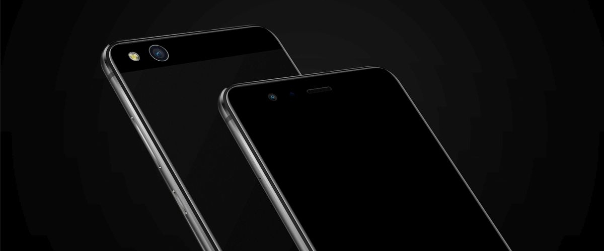

+++
title = "Installing a custom ROM on Huawei hi6250 devices"
date = "2024-02-18"
tags = ["technical", "howto"]
+++

About installing a [custom ROM](https://en.wikipedia.org/wiki/Custom_firmware#Android) on Huawei hi6250 devices.

<!--more-->

## Preface

This guide is for madmen who will attempt to install a custom ROM on these devices. Because of how Huawei made its smartphones, we need to follow more complicated steps than when flashing custom ROMs on other OEMs.

For unlocking the bootloader/FRP see [PotatoNV](https://github.com/mashed-potatoes/PotatoNV).

## Android 8.1

The target version for these devices, I recommend installing it, because other versions will feel less snappy and responsive. Also after installing a bunch of Android versions I came to appreciate this version, as the best version of Android.

In these steps I don't really know what made possible installing it, because it was a big headache for me with all these options at hand. I will be referring to 'decrypt kit' as the following scripts, they are scattered on the xda forums of Huawei p8 lite 2017 and Huawei p10 lite:
- [1-Huawew-DataPrep-DeCrypt-A-v1.0-signed.zip](https://sourceforge.net/projects/altairfr-huawei/files/patches/A-Only/1-Huawei-DataPrep-DeCrypt-A-v1.0-signed.zip/download)
- [2-Huawei-system-UnCrypt-v1.3-signed.zip](https://sourceforge.net/projects/altairfr-huawei/files/patches/A-Only/2-Huawei-system-UnCrypt-v1.3-signed.zip/download)
- [Huawei-Decrypt-Emui_8.zip](https://sourceforge.net/projects/darkjoker360-developements/files/Huawei/Huawei-Decrypt-Emui_8.zip/download)
- [Universal DM-Verity, ForceEncrypt, Disk Quota Disabler](https://xdaforums.com/t/deprecated-universal-dm-verity-forceencrypt-disk-quota-disabler-11-2-2020.3817389/)
- [fstab.hi6250b-OLD.zip](https://sourceforge.net/projects/darkjoker360-developements/files/Huawei/fstab.hi6250b-OLD.zip/download)
- [patch_r2.zip](https://sourceforge.net/projects/darkjoker360-developements/files/Huawei/P10%20Lite/Android-10/patch_r2.zip/download)
- ['los_patches_warsaw' or 'los_patches_prague' on DarkJoker360's SourceForge](https://sourceforge.net/projects/darkjoker360-developements/files/Huawei/)

Steps:
- Get stock
- Unlock bootloader
- Install [DarkJoker360's TWRP for Oreo](https://sourceforge.net/projects/darkjoker360-developements/files/Huawei/P8%20Lite%202017/Pie/TWRP/) and wipe everything
- Use the 'decrypt kit'
- Install [Dil3mm4's TWRP](https://xdaforums.com/t/recovery-treble-11-05-twrp-3-2-1-0-for-huawei-p8-lite-2017-all-variants.3773970/) and with it install everything
- Optional (I think): Install any Android 10 based ROM (it will just work)
- Use the 'decrypt kit'
- Install [DarkJoker360's LineageOS 15.1](https://sourceforge.net/projects/darkjoker360-developements/files/Huawei/P8%20Lite%202017/Oreo/LineageOS-15.1/)
- Resize the system in TWRP
- Format Data
- Use the 'decrypt kit'
- Boot to the system

## Other versions

For AOSP up to Android 11 (without Gapps!) there's no need for resizing the system partition on the stock, but for LineageOS (from AltairFR) you need to follow the resizing steps from [this thread](https://xdaforums.com/t/rom-prague-11-lineageos-18-1-for-huawei-p8-lite-2017.4275551/), do resizing on Windows, because Linux scripts are incomplete! I had installed LineageOS 18.1 with Android 11 and it was working mostly well, but I think that it's too much for this phone at this stage, so I reverted to AOSP.

For installing AOSP I followed [this thread](https://xdaforums.com/t/rom-11-darkjoker360-aosp-11-for-huawei-p8-lite-2017.4220705/). It didn't pass the splash screen so I flashed it again, this time I decrypted the data partition using DarkJoker's utility and AltairFR's from the Lineage thread, I also flashed Magisk (don't know which of these worked, I think that decrypting and Magisk combined). Also I looked into /vendor/etc/fstab file and didn't have encryption, see [this thread](https://xdaforums.com/t/aio-prepare-your-device-and-your-knowledge-for-any-gsi.3812024/).

I also installed the LineageOS 17.1 (Android 10) from DarkJoker, and it costantly restarted the System UI. To fix it I did [this](https://xdaforums.com/t/rom-10-lineageos-17-1-for-huawei-p8-lite-2017.4064121/post-83043203) (basically first wiped everything with DarkJoker's TWRP, then flashed Dil3mm'4s TWRP with it I flashed then the system.img, and everything worked well).

## Regarding the WebView and browsing the web

AOSP (Android 10, 11), and Lineage (Android 10, 8.1) from DarkJoker360 don't have updated [webview](https://developer.android.com/reference/android/webkit/WebView), which is necessary for browsing the web on older devices, because for example on Fennec browser (with GeckoView) Github took 15 seconds to load, but on [Fulguris browser](https://slions.net/resources/fulguris.10/) (with system webview AND ad-block) 5 seconds, I'm using the Github as a benchmark, because it's the most bloated website I know of. Version 81 is working fairly well with rendering every page (except for the Github README.md file only, and WSJ). Version 86 can render Github correct.

There are a few WebView providers e.g. [Mulch](https://gitlab.com/divested-mobile/mulch), [Bromite](https://www.bromite.org/system_web_view), or [Vanadium](https://github.com/GrapheneOS/Vanadium) which have more up-to-date versions, that will need to be used in the future.

## Sidenote

All of this took me about 3 weeks in total with more than 50 hours in. I won't buy a Huawei phone ever again :/
