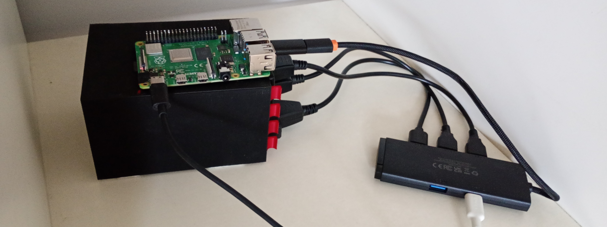

+++
title = "My homelab"
date = "2025-06-06"
tags = ["technical", "howto"]
+++

My [Raspberry Pi](https://www.raspberrypi.com/) homelab with an overview of services I self-host.

<!--more-->

## Hardware and software

I have 3 disks connected to my Raspberry Pi 4b (1 GB model) and [cockpit](https://cockpit-project.org/) (with file sharing and podman addons) to manage it graphically from any device without the need of SSH.

## Network Attached Storage (NAS)

On the first disk that is mounted in `/srv` I have my [samba](https://www.samba.org/) share connected to `/srv/smb`, but other services in `/srv/<service_name>`. I'm using [cockpit-file-sharing](https://github.com/45Drives/cockpit-file-sharing) to ease setting it up. I also have cron jobs with rsync to copy my data on other disks.

TIP: To set up a new user for SMB share: `sudo smbpasswd -a $USER` and `sudo smbpasswd -e $USER`.

## Reverse proxy

I tried setting up [Adguard Home](https://adguard.com/en/adguard-home/overview.html) with [Nginx Proxy Manager](https://nginxproxymanager.com/setup/), but couldn't get DNS rewrites and reverse proxy to work, so I left it. I also don't have admin access to the router, and after calling my ISP they said they cannot set up any custom DNS, nor set a static address, great...

My quasi-solution is to use [mDNS](https://en.wikipedia.org/wiki/Multicast_DNS) on the Pi, so that I can use the `hostname.local:PORT` to access it, while it's IP changes.

## Music library

I'm using [Navidrome](https://www.navidrome.org/) to organize and access my music library.
    
## Personal knowledge base/notes

I'm using [silverbullet](https://silverbullet.md), because I wanted something simple with Markdown support (it's super extensive which I think will be of use in the future).

## Media server

I've set up [Jellyfin](https://jellyfin.org/) server on it and it works great without [transcoding](https://jellyfin.org/docs/general/clients/codec-support/).

TIP: If you are using mDNS then instead of `network_mode: host` in the example `docker-compose` file you can simply forward the `8096` port.
    
## RSS Reader

I'm using [FreshRSS](https://www.freshrss.org/) to manage and read RSS feeds.

## Password Manager

Since I [don't have a reverse proxy](#reverse-proxy) I can't set up a secure HTTPS connections and using a password manager while leaking passwords would be meaningless.

## Calendar

I’m using [Baikal](https://sabre.io/baikal/) to have a [CalDAV](https://en.wikipedia.org/wiki/CalDAV) server that can be used across my devices.

## Media tracker

To track my media usage (or more likely store information about my recently consumed media) I’m using [Yamtrack](https://github.com/FuzzyGrim/Yamtrack).

## Dashboard

To get an overview of all of my services I’m using [mafl](https://mafl.hywax.space/) as my dashboard, which is conveniently served at the port 80 for easy access.

## Anki sync server

I’m also self-hosting my own [Anki sync server](https://docs.ankiweb.net/sync-server.html) to sync Anki decks across my devices.

## Systemd units

Since I'm running rootless podman containers and `podman systemd generate` is now deprecated I'm using [Quadlet](https://docs.podman.io/en/latest/markdown/podman-systemd.unit.5.html) to run containers as systemd services. [This guide](https://mo8it.com/blog/quadlet/) shows how to work with them and [podlet](https://github.com/containers/podlet) can help you generate `.container` files for your containers. That way I can set it up to run after (re)boot and enable other options like [auto-update](https://docs.podman.io/en/latest/markdown/podman-auto-update.1.html).

## Other tips

* Use `nmap` to find the Pi's IP address if you don't have an access to your router.
* Check out [powertop](https://github.com/fenrus75/powertop) in order to disable power saving features.
* Enable [lingering](https://www.freedesktop.org/software/systemd/man/latest/loginctl.html#:~:text=Enable%2Fdisable%20user%20lingering%20for,to%20run%20long%2Drunning%20services) to avoid shutting down user processes after logging out of the system.
* If you can't connect to `hostname.local` in the browser on Linux, but can ssh into it then it means that your distro doesn't have mDNS enabled/started.

Well, it took some time to arrange, but I'm happy that I'm using so many services without relaying on third-parties.
