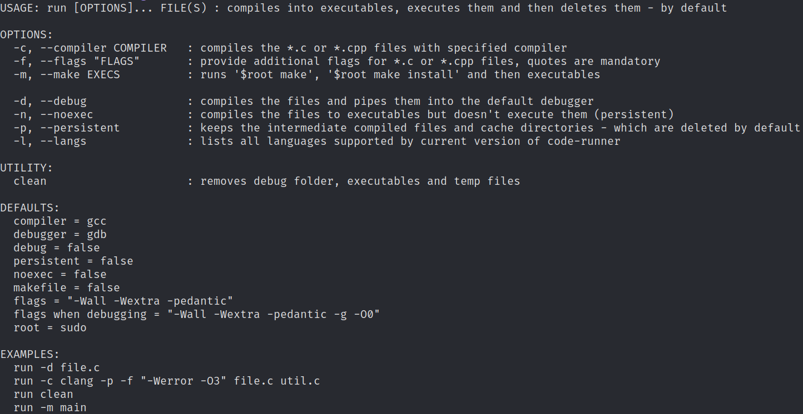

+++
image = "code-runner1.png"
date = "2024-01-27"
title = "code_runner - code runner in POSIX shell"
type = "gallery"
customcss = "/css/projects.css"
+++


    <h1><a href="https://codeberg.org/marendowski/code-runner" target="_blank">code-runner</a></h1>


## About

POSIX shell script to run, compile and delete executables etc. Sometimes useful.
