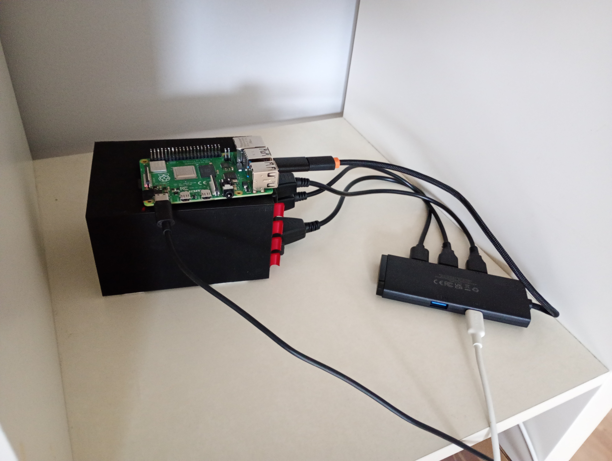

+++
image = "nas1.jpg"
date = "2025-06-06"
title = "My homelab"
type = "gallery"
customcss = "/css/projects.css"
+++

## About

It's not a project per se, but it's something 15 years-old me wanted to do after first hearing about the [Raspberry Pi](https://www.raspberrypi.com/), which now after accumulating 6 years of knowledge I have done - for which it deserves it's own place in the projects gallery. Here's [my blog post](../../posts/homelab) describing this setup in detail.
