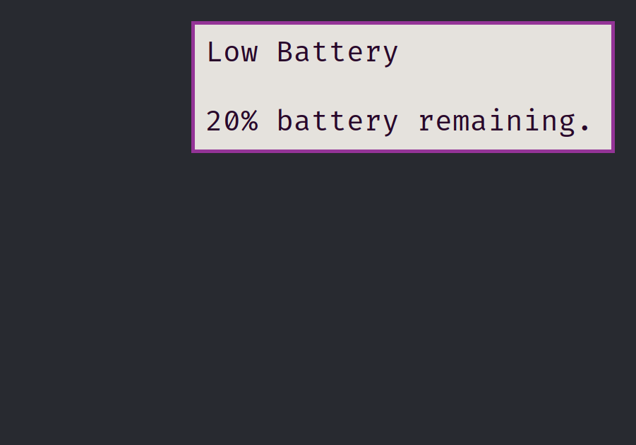

+++
image = "luft1.png"
date = "2024-08-22"
title = "luft - dbus-less notification “daemon” for wlroots compositors"
type = "gallery"
customcss = "/css/projects.css"
+++


    <h1><a href="https://codeberg.org/marendowski/luft" target="_blank">luft</a></h1>


## About

Second project related to graphics and drawing (on the screen) in Linux. [The making of luft](../../posts/luft) describes the turbulent development of it.
