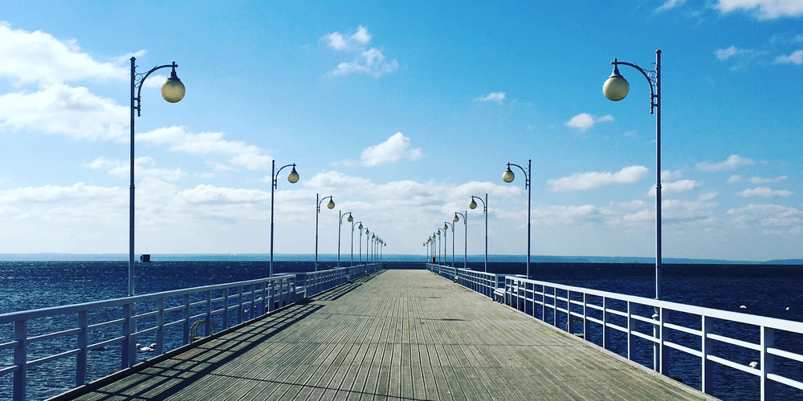

+++
image = "hel-poland-3.jpg"
date = "2020-02-06"
title = "Project 3 - blazingly fast memory safe rewrite of the perfectly fine working program"
type = "gallery"
+++

# Need to have three for it to look good on the gallery

English is weird
